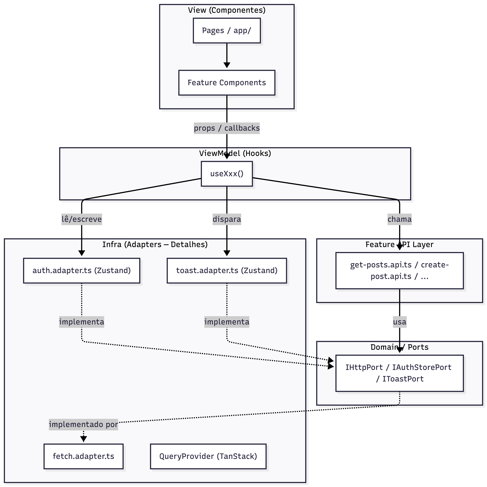
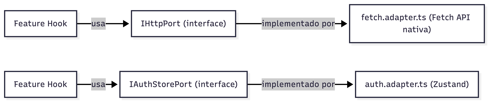
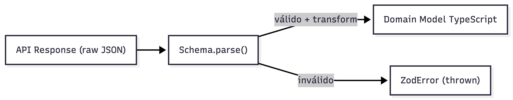
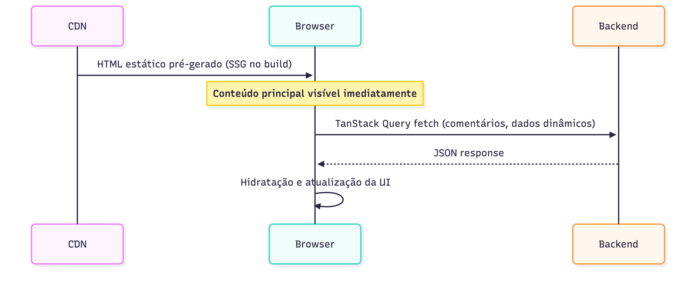
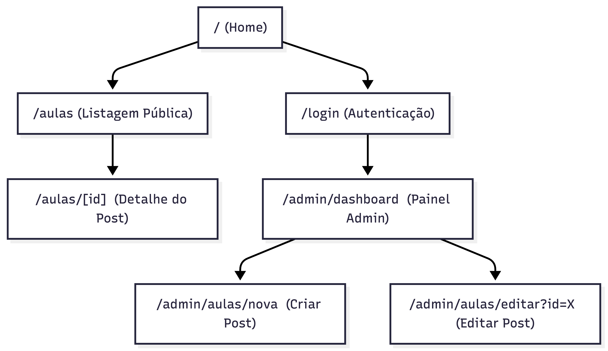
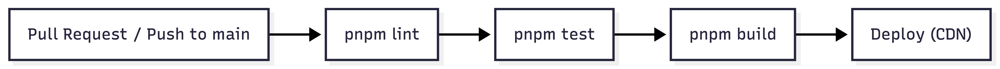

# Tech Challenge: Blog Aulas — Frontend

> Interface Web responsiva construída com **Next.js** do "Blog Aulas", conectando professores e alunos.

**🔗 Backend API:** [tech-challenge-blog-aulas-backend.azurewebsites.net](https://tech-challenge-blog-aulas-backend.azurewebsites.net/health) · [Repositório Backend](https://github.com/gfpaiva/tech-challenge-blog-aulas-backend)

---

## 📋 Índice

- [Sobre o Projeto](#sobre-o-projeto)
- [Stack Tecnológica](#stack-tecnológica)
- [Arquitetura e Padrões](#arquitetura-e-padrões)
- [Estrutura de Pastas](#estrutura-de-pastas)
- [Pré-requisitos](#pré-requisitos)
- [Setup Inicial](#setup-inicial)
- [Variáveis de Ambiente](#variáveis-de-ambiente)
- [Comandos Disponíveis](#comandos-disponíveis)
- [Mapa de Rotas](#mapa-de-rotas)
- [Testes](#testes)
- [CI/CD e Deploy](#cicd-e-deploy)

---

## Sobre o Projeto

O **Blog Aulas** é uma plataforma educacional que permite a professores publicarem aulas e a alunos consumirem esse conteúdo publicamente. A interface foi construída priorizando performance (SSG/SSR híbrido).

**Papel dos usuários:**
- **PROFESSOR:** Autentica-se, gerencia posts (criar, editar, excluir) via painel administrativo.
- **ALUNO:** Navega e lê posts publicados, pode comentar quando autenticado.

---

## Stack Tecnológica

| Categoria | Tecnologia | Versão |
|---|---|---|
| Framework | Next.js (App Router) | 16.1.7 |
| Linguagem | TypeScript | ^5 |
| Runtime | React | 19.2.3 |
| Estilização | Tailwind CSS v4 + DaisyUI v5 | ^4 / ^5 |
| Estado Global | Zustand | ^5.0.12 |
| Data Fetching (Client) | TanStack Query | ^5.90.21 |
| Formulários | React Hook Form + Zod | ^7 / ^4 |
| Ícones | Lucide React | ^0.577.0 |
| Merge de Classes | clsx + tailwind-merge | ^2 / ^3 |
| Testes | Vitest + Storybook addon-vitest | ^4 |
| Documentação de UI | Storybook | ^10 |

---

## Arquitetura e Padrões

Este projeto segue uma arquitetura **Hexagonal (Portas e Adaptadores)** combinada com **Vertical Slices**, resultando numa base de código altamente desacoplada, testável e escalável.

### 1. Visão Geral: Fluxo de Camadas




### 2. Padrão MVVM

| Camada | Responsabilidade | Local |
|---|---|---|
| **View** | Renderizar UI, delegar eventos via props. Zero lógica de negócio. | `features/*/components/` |
| **ViewModel** | Orquestrar estado, fetch, formulários e submissões. | `features/*/hooks/useXxx.ts` |
| **Model** | Tipos TypeScript, schemas Zod, mappers. | `features/*/types/`, `features/*/mappers/` |

### 3. Port/Adapter (Hexagonal)

O código de negócio nunca depende de implementações concretas. Ele acessa apenas **interfaces** (Ports), enquanto os **Adapters** na camada `infra/` as implementam:



### 4. Mappers e Validação com Zod

Nenhum payload raw da API chega sujo ao frontend. Cada feature define schemas Zod que **validam** e **transformam** a resposta:



**Exemplo real (`post.mapper.ts`):** O campo `creationDate` da API chega como string ISO. O `transform` do Zod o converte automaticamente para `"20 mar. 2026"` (pt-BR) antes de entregar para o componente.

### 5. Renderização Híbrida (SSG + Client-Side)



---

## Estrutura de Pastas

```
src/
├── app/                            # Roteamento puro (Next.js App Router)
│   ├── (auth)/                     # Grupo de rotas autenticadas
│   │   └── template.tsx            # Layout do grupo auth
│   ├── (public)/                   # Grupo de rotas públicas
│   │   ├── page.tsx                # Home page
│   │   └── template.tsx            # Layout público (Header/Footer)
│   ├── globals.css                 # Design tokens + DaisyUI themes
│   └── layout.tsx                  # Root layout (Providers, fontes)
│
├── common/                         # Compartilhado globalmente
│   ├── components/                 # Componentes compartilhados globalmente
│   ├── config/
│   │   └── routes/index.ts         # ⭐ Configuração centralizada de rotas
│   ├── hooks/                      # Hooks compartilhados globalmente
│   ├── lib/
│   │   └── utils.ts                # cn() — merge inteligente de classes CSS
│   ├── ports/                      # Interfaces / contratos abstratos
│   └── types/
│
├── infra/                          # Adapters (implementação de detalhes)
│
└── features/                       # Vertical Slices de domínio
```

---

## Pré-requisitos

- **Node.js** v20+
- **pnpm** v10+
- **Backend** rodando em `http://localhost:3000` (ou configure via variáveis de ambiente)

---

## Setup Inicial

### 1. Clone o repositório

```bash
git clone https://github.com/gfpaiva/tech-challenge-blog-aulas-frontend.git
cd tech-challenge-blog-aulas-frontend
```

### 2. Instale as dependências

```bash
pnpm install
```

### 3. Configure as variáveis de ambiente

```bash
cp .env.development .env.local
# Edite .env.local com suas configurações caso necessário
```

### 4. Inicie o servidor de desenvolvimento

```bash
pnpm dev
```

Acesse [http://localhost:3001](http://localhost:3001) (ou a porta exibida no terminal).

---

## Variáveis de Ambiente

| Variável | Padrão | Descrição |
|---|---|---|
| `NEXT_PUBLIC_API_URL` | `http://localhost:3000` | URL base da API do backend |

> **Prefixo `NEXT_PUBLIC_`:** Obrigatório para variáveis que precisam ser expostas ao bundle do cliente. Variáveis sem este prefixo só existem no servidor de build.

---

## Comandos Disponíveis

| Comando | Descrição |
|---|---|
| `pnpm dev` | Inicia o servidor de desenvolvimento (Next.js Dev Server) |
| `pnpm build` | Gera o export estático completo em `./out/` |
| `pnpm start` | Serve o bundle de produção (requer `pnpm build` antes) |
| `pnpm lint` | Executa o ESLint para análise estática de código |
| `pnpm storybook` | Inicia o Storybook em `http://localhost:6006` |
| `pnpm build-storybook` | Gera o build estático do Storybook em `./storybook-static/` |
| `pnpm test` | _(a definir)_ Executa a suite completa de testes via Vitest |

---

## Mapa de Rotas



---

## Testes

> ⚠️ _Esta seção será expandida quando a suite de testes for implementada._

### Estratégia

| Tipo | Ferramenta | Foco |
|---|---|---|
| **Unit / Integration** | Vitest | Mappers, hooks, lógica de domínio |
| **Visual / Component** | Storybook + addon-vitest | Componentes UI isolados (Dumb) |

### Comandos de Teste

```bash
pnpm test                  # Executa todos os testes
pnpm test:coverage         # Relatório de cobertura (@vitest/coverage-v8)
```

---

## CI/CD e Deploy

> ⚠️ _Esta seção será expandida quando os pipelines forem configurados._

### Estratégia de Deploy

Como o app utiliza `output: 'export'` do Next.js, o resultado do `pnpm build` é uma pasta `./out/` com HTML/CSS/JS **totalmente estáticos**, sem necessidade de servidor Node.js em produção.

```
pnpm build
  └── ./out/
        ├── index.html
        ├── aulas/
        │   ├── index.html
        │   └── [id]/index.html   ← gerados via generateStaticParams
        ├── admin/
        │   └── dashboard/index.html
        └── _next/static/         ← assets JS/CSS
```

Esta pasta pode ser servida por qualquer CDN estática (Vercel, Netlify, Azure Static Web Apps, GitHub Pages, etc).

### Pipeline CI (planejado)



| Etapa | Descrição |
|---|---|
| **Lint** | ESLint verifica padrões de código e imports |
| **Testes** | Vitest executa unit + component tests |
| **Build** | Valida que o export estático compila sem erros |
| **Deploy** | Upload do `./out/` para o provedor de hosting |

### Pipeline CD (planejado)

O deploy contínuo seguirá o mesmo padrão do backend: **Conventional Commits** → **Release Please** para versionamento automático → pipeline de upload para hosting estático.

---

## Convenções de Código

### Commits (Conventional Commits)

```
feat(posting): add infinite scroll to public posts list
fix(auth): redirect to intended page after login
chore: update dependencies
refactor(admin): extract PostForm into reusable component
```

---

## Links Úteis

| Recurso | URL |
|---|---|
| Backend API | [tech-challenge-blog-aulas-backend.azurewebsites.net](https://tech-challenge-blog-aulas-backend.azurewebsites.net) |
| Repositório Backend | [github.com/gfpaiva/tech-challenge-blog-aulas-backend](https://github.com/gfpaiva/tech-challenge-blog-aulas-backend) |
| DaisyUI Components | [daisyui.com/components](https://daisyui.com/components/) |
| TanStack Query Docs | [tanstack.com/query/v5](https://tanstack.com/query/v5) |
| Next.js Static Export | [nextjs.org/docs/app/building-your-application/deploying/static-exports](https://nextjs.org/docs/app/building-your-application/deploying/static-exports) |
